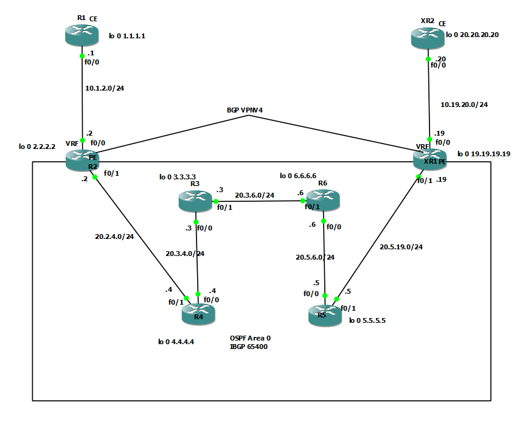

# MPLS, MPBGP and L3VPN configuration

## Introduction
This guide covers the configuration of MPLS, MP-BGP, and L3VPN on a Cisco-based topology. The goal is to enable communication between customer sites across an MPLS core using VPNv4 routes.

## Steps to Configure MPLS

### 1. Configure OSPF routing in ISP cloud
Enable OSPF on all routers that form the ISP backbone. Be sure to include loopback interfaces — they are essential for LDP and BGP to function correctly.
```sh
router ospf 1
network (network adress) (wildcard mask) area 0
```
 Note: Loopback interfaces are used as stable router IDs and endpoints for LDP and BGP sessions.

### 2. Enable MPLS on ISP routers

```sh
router ospf 1
mpls ldp autoconfig
```
This command activates MPLS (LDP) on every interface participating in OSPF. We can do this manually assigning the interfaces using commands below
```sh
interface GigabitEthernet0/1
mpls ip
mpls label protocol ldp
mpls ldp router-id Loopback0 force
```

### 3. Configuring MP-BGP to establish VPNV4 beetween R1 and R3
We now set up MP-BGP between Provider Edge routers R2 and XR1, even though there is no direct connection between them.
```sh
router bgp 65400
neighbor 19.19.19.19 remote-as 65400
neighbor 19.19.19.19 update-source lo 0
no auto-summary
```
Do this on both routers changing of course the neighbor id
Explanation:
Even though R2 and XR1 are not directly connected, BGP will still work. When R1 wants to reach R3:
1. It checks the BGP table — the neighbor is not directly connected.
2. It then checks the OSPF table and finds a route to R3’s loopback.
3. MPLS uses that route and labels the packet.
4. The labeled packet is sent across the MPLS core to reach XR1.
This creates a logical tunnel across the ISP cloud using MPLS, allowing R2 and XR1 to peer using MP-BGP and exchange VPNv4 routes.

### 4. Configuring VPNV4 beetween R1 and R3
```sh
router bgp 65400
address-family vpnv4
neighbor 19.19.19.19 activate
```
Thats gonna configure routing protocol like bgp to use a standard VPNV4 address prefix and by this command we actually set up a VPN between routers R2 and XR1. Also you need to do the mirror configuration on XR1.

### 5. Configuring VRF 
Now, let's configure VRF on the provider edge (PE) routers to isolate customer traffic. Each customer will have its own VRF, and we'll ensure that the traffic is routed separately within the ISP network.

```sh
ip vrf (name)
rd <AS Number>:<Unique Number>
route-target import <AS Number>:<Unique Number>
route-target export <AS Number>:<Unique Number> // You can use just route-target both <AS Number>:<Unique Number>
```
The Route Distinguisher (RD) is used to uniquely identify routes within the MPLS network. This is particularly important in scenarios where multiple VRFs are being used, to avoid route collisions between different customers. The RD effectively "tags" each route so that the same IP prefix can appear in different VRFs without causing conflicts.
Example:
In this case, rd 4:4 means that the RD is set to 4:4, where the first number (4) is the AS number or a unique identifier for the router or VPN provider, and the second number (4) is an arbitrary unique value to differentiate multiple VRFs within the same AS.
Now, on R2, on the interface that is connected to the CE router, configure the VRF:
```sh
interface GigabitEthernet0/1
ip vrf forwarding (Customer_Name)
ip address (Network_Address) (Subnet_Mask)
```
To check the routing table for VRF use:
```sh 
ip route vrf (Customer_Name)
```
You can also ping to verify the connectivity:
```sh 
ping vrf (Customer_Name) (destination_IP)
```
The ip vrf forwarding (Customer_Name) command associates the interface with the VRF. The ip address (Network_Address) (Subnet_Mask) assigns an IP address to that interface.

### 6. Configuring the defult route on CE routers
To configure defult routes within the VRF, use the following commands on both PE and CE routers:
On CE:
```sh 
ip route 0.0.0.0 0.0.0.0 10.1.2.2
```
On PE:
```sh 
ip route vrf cust-a 1.1.1.1 255.255.255.255 10.1.2.1
```
### 7. Redistribute defult routes into BGP.
To redistribute OSPF routes into BGP, use the following configuration:
```sh 
router bgp 65400
address-family ipv4 vrf (Customer_Name)
redistribute static
```


