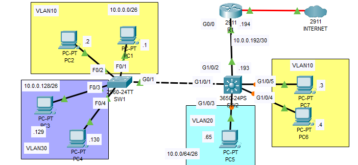

**Layer 3 Switch VLAN Configuration Guide**

### **Introduction**
A Layer 3 switch allows VLAN segmentation and inter-VLAN routing without requiring an external router. This setup is commonly used in enterprise networks where VLANs need to communicate efficiently within the switch itself.

### **Network Topology**
- **Layer 3 Switch**: Handles VLAN configuration and inter-VLAN routing.
- **End Devices**: Assigned to different VLANs.

### **Step-by-Step Configuration**
#### **Step 1: Configure VLANs on the Switch (SW1 as an example)**
1. Enter privileged EXEC mode:
   ```
   enable
   ```
2. Enter global configuration mode:
   ```
   configure terminal
   ```
3. Create VLANs:
   ```
   vlan 10
   name Sales
   exit
   vlan 20
   name IT
   exit
   vlan 30
   name HR
   exit
   vlan 99
   name Native_VLAN
   exit
   ```
4. Assign switch ports to VLANs:
   ```
   interface range FastEthernet0/1-2
   switchport mode access
   switchport access vlan 10
   exit
   interface range FastEthernet0/3-4
   switchport mode access
   switchport access vlan 20
   exit
   ```
5. Configure the trunk port between switches:
   ```
   interface GigabitEthernet0/1
   switchport mode trunk
   switchport trunk allowed vlan 10,20,30
   switchport trunk native vlan 99
   exit
   ```

#### **Step 2: Configure Inter-VLAN Routing on the Layer 3 Switch**
1. Enable IP routing:
   ```
   ip routing
   ```
2. Create VLAN interfaces (SVIs) for routing between VLANs:
   ```
   interface Vlan10
   ip address 10.0.0.62 255.255.255.192
   no shutdown
   exit
   interface Vlan20
   ip address 10.0.0.126 255.255.255.192
   no shutdown
   exit
   interface Vlan30
   ip address 10.0.0.190 255.255.255.192
   no shutdown
   exit
   ```
3. Assign a management IP to the native VLAN:
   ```
   interface Vlan99
   ip address 10.0.0.254 255.255.255.0
   no shutdown
   exit
   ```
4. Save the configuration:
   ```
   write memory
   ```

#### **Step 3: Verify Connectivity**
1. Check VLAN assignment on the switch:
   ```
   show vlan brief
   ```
2. Verify trunk configuration:
   ```
   show interfaces trunk
   ```
3. Test inter-VLAN communication:
   ```
   ping 10.0.0.126
   ```

### **Conclusion**
The Layer 3 switch configuration enables communication between multiple VLANs without needing an external router. This method enhances performance and simplifies network architecture while providing efficient inter-VLAN routing.

**End of Guide**

