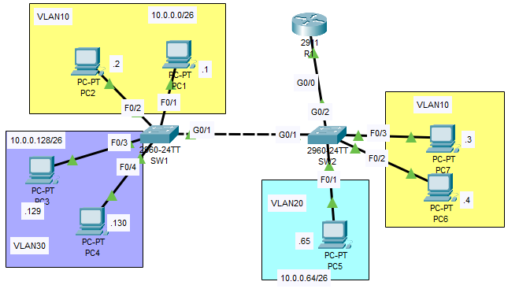

**Router-on-a-Stick Configuration Guide**

### **Introduction**
Router-on-a-Stick is a networking configuration where a single physical router interface is used to route traffic between multiple VLANs. This setup is commonly used in small to medium-sized networks where multiple VLANs need to communicate but only one physical router interface is available.

### **Network Topology**
- **Router**: Acts as the Layer 3 device to route traffic between VLANs.
- **Switch**: Configured with multiple VLANs.
- **End Devices**: Assigned to different VLANs.

### **Step-by-Step Configuration**
#### **Step 1: Configure VLANs on the Switch(SW1 as an example)**
1. Enter privileged EXEC mode:
   ```
   enable
   ```
2. Enter global configuration mode:
   ```
   configure terminal
   ```
3. Create VLANs:
   ```
   vlan 10
   name Sales (not necessary)
   exit
   vlan 30
   name IT
   exit
   ```
4. Assign switch ports to VLANs:
   ```
   interface range FastEthernet0/1-2
   switchport mode access
   switchport access vlan 10
   exit
   interface range FastEthernet0/3-4
   switchport mode access
   switchport access vlan 20
   exit
   ```
5. Configure the trunk port to the router:
   ```
   interface GigabitEthernet0/1
   switchport mode trunk
   switchport trunk allowed vlan 10,30
   exit
   ```
   VLAN 20 doesn't need to be added because there are no hosts in this VLAN connected to this switch.

#### **Step 2: Configure the Router**
1. Enter global configuration mode:
   ```
   enable
   configure terminal
   ```
2. Create sub-interfaces for each VLAN:
   ```
   interface GigabitEthernet0/0.10
   encapsulation dot1Q 10
   ip address 192.168.10.1 255.255.255.0
   exit
   interface GigabitEthernet0/0.20
   encapsulation dot1Q 20
   ip address 192.168.20.1 255.255.255.0
   exit
   ```
3. Save the configuration:
   ```
   write memory
   ```

#### **Step 3: Verify Connectivity**
1. Check VLAN assignment on the switch:
   ```
   show vlan brief
   ```
2. Verify trunk configuration:
   ```
   show interfaces trunk
   ```
3. Test inter-VLAN communication:
   ```
   ping 192.168.20.1
   ```

### **Conclusion**
The Router-on-a-Stick configuration enables communication between multiple VLANs using a single physical interface on the router. This method is efficient, cost-effective, and widely used in enterprise networks.

